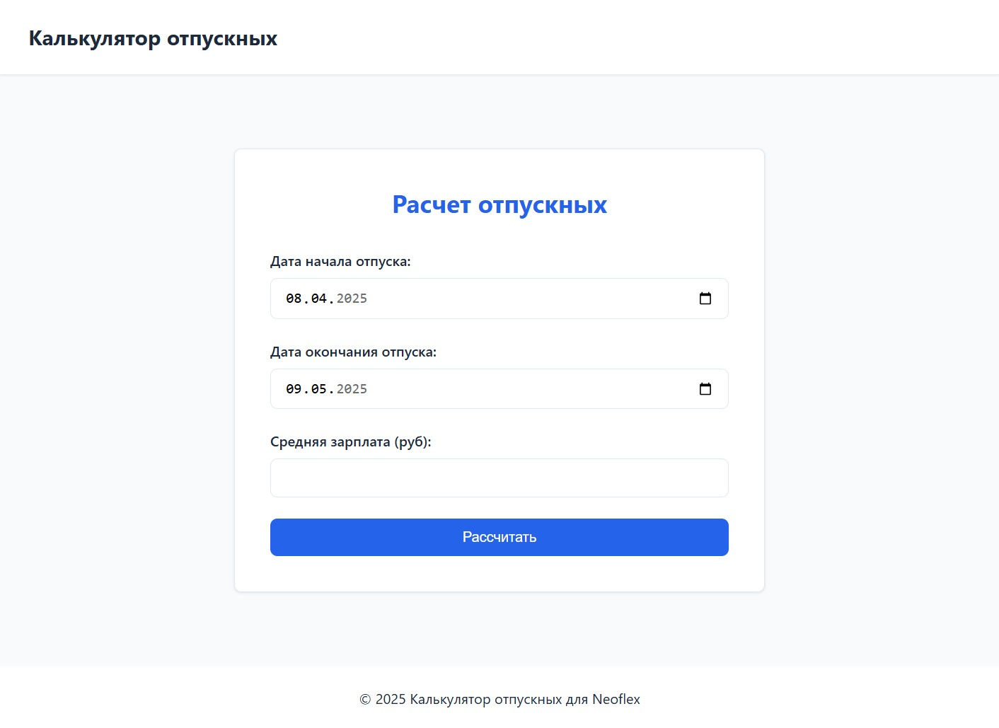
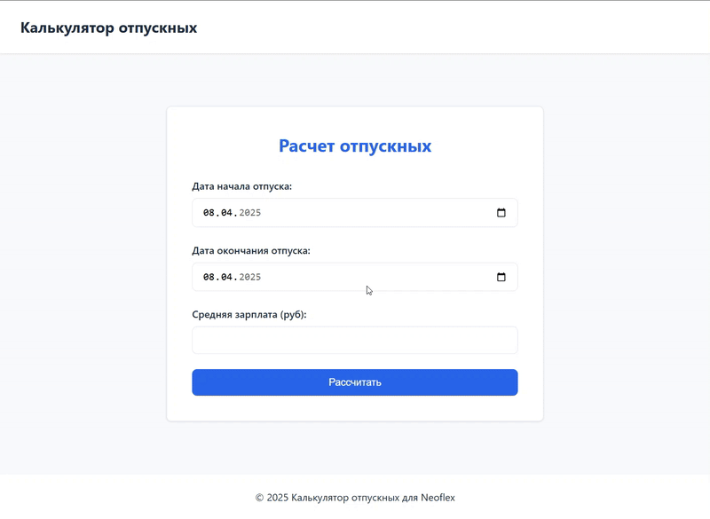

# Приложение "Калькулятор отпускных"
Java 11, Spring Boot, Maven, Docker, Thymeleaf, HTML, CSS, JavaScript

## О проекте
Микросервисное приложение, которое принимает среднюю зарплату за 12 месяцев и диапазон дат отпуска 
и рассчитывает сумму отпускных, которые придут сотруднику.

Приложение покрыто тестами сервисов и контроллеров.

## Структура
Приложение содержит два микросервиса:
- calendar-service, содержащий государственные праздники за 2025 год и рассчитывающее список праздников, выходных и рабочих дней 
- vacation-service, рассчитывающий отпускные и предоставляющий веб-интерфейс для рассчета отпускных выплат 

### Сервис календаря

Содержит праздничные дни за 2025 год, определяет выходные и рабочие дни.

#### GET /days?startDate={startDate}&endDate={endDate}

Образец ответа:

```
{
    "startDate": "2025-01-01",
    "endDate": "2025-01-10",
    "holidays": [
        "2025-01-01",
        "2025-01-02",
        "2025-01-03",
        "2025-01-04",
        "2025-01-05",
        "2025-01-06",
        "2025-01-07"
    ],
    "nonWorkingDays": [],
    "workingDays": [
        "2025-01-08",
        "2025-01-09",
        "2025-01-10"
    ]
}
```

### Сервис отпусков

Сервис рассчета отпускных выплат.

Сообщается с сервисом календаря по REST API, получает праздничные, выходные и рабочие дни за заданный интервал 2025 года
и рассчитывает сумму отпускных на основе значения средней зарплаты за последние 12 месяцев.

В случае, если стоимость рабочего дня меньше стоимости дня согласно МРОТ на 2025 год, расчет ведется от стоимости дня согласно МРОТ на 2025 год.

Имеет интерактивный фронтенд интерфейс: 

#### GET /

Образец ответа:



После отправки формы вызывает REST API:

#### GET /calculate?startDate={startDate}&endDate={endDate}&avgAnnualSalary={avgAnnualSalary}"

```
{
  "startDate": "2025-04-08",
  "endDate": "2025-12-08",
  "amount": 13567.38
}
```

## Запуск приложения

```
docker compose up
```

### Важно

В случае локального запуска в строке com/example/service/VacationServiceImpl.java:48 необходимо заменить calendar-service:9090 на localhost:{порт} для корректного сообщения сервисов

## Документация и тесты API
Каждый сервис содержит postman-collection - коллекцию тестов Postman, а также Swagger API 

## Демонстрация 

